# Architecture Overview — GEA / CRICAT / SD-MAC

This page provides a component-by-component description of the platform and its
non-proprietary data flows, with refined non-proprietary architecture diagrams
for GEA, CRICAT, and SD-MAC.

**Non-proprietary notice.** Every diagram and description on this page is
non-proprietary. The platform consumes only public and openly licensed data and
open-source components. No proprietary or employer code, data, dashboards, models,
parameters, schemas, identifiers, screenshots, or workflow descriptions appear
in any diagram or its source. All bundled fixtures referenced by the components
are synthetic illustrative data generated for demonstration — they are not real
agency data and not derived from any proprietary or employer source.

**Governance posture.** The platform is intended for public release under the
Open Energy Finance Analytics Foundation (OEFAF), which is in formation as a
Section 501(c)(3) public charity. References to OEFAF governance describe a
planned nonprofit; nothing here asserts that OEFAF is incorporated or
registered.

The diagram sources below are authored in [Mermaid](https://mermaid.js.org/) and
rendered to both `.svg` and `.png`. Each diagram has a `.mmd` source under
`docs/architecture/diagrams/`.

---

## 1. Platform overview



*(PNG: [`diagrams/platform_overview.png`](diagrams/platform_overview.png) ·
source: [`diagrams/platform_overview.mmd`](diagrams/platform_overview.mmd))*

The platform draws on public and openly licensed data sources — weather and
climate feeds (NOAA NCEP, ECMWF Open Data), public energy-market data (EIA,
ISO/RTO public reports), reliability and regulatory references (NERC, FERC), and
sanctions / trade / AIS / satellite sources (OFAC, public AIS aggregators,
Copernicus / USGS).

Two analytics components consume these inputs:

- **GEA (Geopolitical-Event Analytics)** ingests and scores public-source events
  to estimate supply-disruption risk.
- **CRICAT (Climate-Risk Integrated Capacity-Allocation Toolkit)** forecasts
  load, models grid regions, and constructs capacity-allocation scenarios.

Both components publish their results through **SD-MAC (Sector-Wide Deployable
Modular Analytics Commons)** — the public REST API, schema registry, and module
manifests — which in turn serves a public portal and open-source repository used
by federal agencies, ISOs/RTOs, utilities, regulators, universities, and
researchers.

The **OEFAF governance** box (a planned nonprofit public charity) sits across the
SD-MAC commons and the user community: it governs the open-source license,
neutrality safeguards, and public-interest mission of the platform.

---

## 2. GEA — Geopolitical-Event Analytics



*(PNG: [`diagrams/gea.png`](diagrams/gea.png) ·
source: [`diagrams/gea.mmd`](diagrams/gea.mmd))*

GEA's data flow is:

1. **Event ingestion** — loaders read public-style inputs: sanctions data (OFAC
   SDN and public archives), public AIS vessel positions, satellite imagery
   (Copernicus / USGS), and weather feeds (NOAA NCEP). In this repository the
   loaders operate on synthetic fixtures shaped like these public sources.
2. **Data cleaning** — normalization, de-duplication, and feature extraction.
3. **Event scoring** — a transparent, deterministic weighted feature aggregation
   produces a `severity_score` in `[0, 1]` with a logistic-squashed
   `confidence`.
4. **Supply-disruption risk estimation** — severity and confidence combine into
   commodity- and region-level supply-disruption risk.
5. **Alert / dashboard output** — results are emitted as
   `supply_disruption_event` records and published through the SD-MAC API at
   `/v1/events`.

---

## 3. CRICAT — Climate-Risk Integrated Capacity-Allocation Toolkit



*(PNG: [`diagrams/cricat.png`](diagrams/cricat.png) ·
source: [`diagrams/cricat.mmd`](diagrams/cricat.mmd))*

CRICAT's data flow is:

1. **Weather / climate inputs** — NOAA NCEP, ECMWF Open Data — plus public
   ISO/RTO market data (PJM, ERCOT, MISO public reports) and NERC reliability
   assessments.
2. **Load forecasting** — an open-source scikit-learn model on calendar and
   synthetic-weather features predicts day-ahead load, producing prediction
   intervals and reporting MAPE. The model is seeded and deterministic.
3. **Grid-region modeling** — reserve margin is computed as
   `(available_capacity - demand) / demand`.
4. **Scenario analysis** — scenarios are parameterized by public stress drivers
   (heatwave, cold snap, outage, fuel constraint).
5. **Capacity-allocation logic** — `probability_of_stress` is a monotone
   function of reserve margin, clipped to `[0, 1]`.
6. **Regulator-ready reporting** — results are emitted as `load_forecast_record`
   and `capacity_allocation_scenario` records and published through the SD-MAC
   API at `/v1/forecasts/{iso_region}` and `/v1/scenarios`.

---

## 4. SD-MAC — Sector-Wide Deployable Modular Analytics Commons



*(PNG: [`diagrams/sdmac.png`](diagrams/sdmac.png) ·
source: [`diagrams/sdmac.mmd`](diagrams/sdmac.mmd))*

SD-MAC is the commons layer that makes GEA and CRICAT outputs discoverable,
queryable, reproducible, and auditable:

- **Public interfaces** — a public REST API (`/v1`) exposing events, forecasts,
  scenarios, and modules, documented by an OpenAPI specification and usage
  guides.
- **Contracts & metadata** — a **schema registry** (`supply_disruption_event`,
  `load_forecast_record`, `capacity_allocation_scenario`, `module_manifest`)
  that validates API payloads, and **module manifests** (one
  `module_manifest` YAML per shipped module) describing each deployable unit.
- **Deployable units** — containerized modules (GEA scoring, CRICAT load
  forecasting, grid modeling) packaged in an open-source repository under the
  MIT license on a public Git platform.
- **Security & auditability** — schema-conformance checks, a `validation_status`
  field, public provenance references, and the contribution / code-review
  policy enforce integrity across the interfaces, contracts, and modules.

External consumers — agencies, ISOs/RTOs, utilities, regulators, universities,
and researchers — interact with the platform exclusively through these public
interfaces.

---

## Regenerating the diagrams

From the repository root, with the Mermaid CLI available:

```bash
for f in docs/architecture/diagrams/*.mmd; do
  npx -y @mermaid-js/mermaid-cli -i "$f" -o "${f%.mmd}.svg"
  npx -y @mermaid-js/mermaid-cli -i "$f" -o "${f%.mmd}.png"
done
```
