# Mock Dashboard Wireframes — GEA / CRICAT / SD-MAC

This page contains textual descriptions and layout-region wireframes for three
public-portal dashboards. It describes the platform's mock dashboard wireframes.

**Non-proprietary notice.** These wireframes are intended for public-portal use
and contain no proprietary visualization, data, or branding from any employer or
proprietary source. The diagrams depict layout regions only (map panes, filter rails,
detail panels, source/scenario panels) — not real data or any employer-internal
interface. Every chart and figure on these dashboards traces back to public-data
provenance.

The wireframe sources below are authored in
[Mermaid](https://mermaid.js.org/) and rendered to both `.svg` and `.png`. Each
wireframe has a `.mmd` source in this directory.

---

## GEA — Disruption Monitor



*(PNG: [`gea_disruption_monitor.png`](gea_disruption_monitor.png) ·
source: [`gea_disruption_monitor.mmd`](gea_disruption_monitor.mmd))*

A public dashboard summarizing currently detected supply-disruption events. The
default view shows a global map with event markers color-coded by severity
(low / moderate / elevated / high), a left-rail filter panel for commodity,
region, and minimum severity, and a right-rail event-detail pane showing time of
detection, severity score, public evidence references, and event narrative. A
bottom panel lists the top public sources that contributed to each detection.
Every chart and figure traces back to public-data provenance.

**Layout regions:** header · left-rail filter panel (commodity, region, minimum
severity) · center map pane (severity-coded markers) · right-rail event-detail
pane · bottom source panel.

---

## CRICAT — Grid-Stress Monitor



*(PNG: [`cricat_grid_stress_monitor.png`](cricat_grid_stress_monitor.png) ·
source: [`cricat_grid_stress_monitor.mmd`](cricat_grid_stress_monitor.mmd))*

A public dashboard for ISO/RTO grid stress and capacity allocation. The default
view shows a U.S. map of public ISO/RTO regions (PJM, ERCOT, MISO, NYISO,
ISO-NE, CAISO, SPP) with a stress indicator per region, a top-bar selector for
time horizon (next 24 hours / next 7 days / seasonal), and a right-rail panel
with predicted load, prediction interval, available capacity, reserve margin,
and stress probability. A bottom panel surfaces scenario explorations using
public weather and demand inputs.

**Layout regions:** header · top-bar time-horizon selector (24 hours / 7 days /
seasonal) · center map pane (public ISO/RTO regions with per-region stress
indicator) · right-rail panel (predicted load, prediction interval, available
capacity, reserve margin, stress probability) · bottom scenario panel.

---

## SD-MAC — Public Portal



*(PNG: [`sdmac_public_portal.png`](sdmac_public_portal.png) ·
source: [`sdmac_public_portal.mmd`](sdmac_public_portal.mmd))*

A public portal for module discovery and reproducibility. The default view shows
a searchable catalog of modules with platform component, license, validation
status, and documentation links, plus a module-detail page exposing inputs,
outputs, dependencies, and contributor history. A "Reproduce This" panel offers
one-click access to public notebooks demonstrating module behavior on public
data.

**Layout regions:** header · search bar (filter by component, license,
validation status) · center catalog pane (component, license, validation status,
documentation links) · right module-detail page (inputs, outputs, dependencies,
contributor history) · "Reproduce This" panel (one-click access to public
notebooks).

---

## Regenerating the wireframes

From the repository root, with the Mermaid CLI available:

```bash
for f in docs/wireframes/*.mmd; do
  npx -y @mermaid-js/mermaid-cli -i "$f" -o "${f%.mmd}.svg"
  npx -y @mermaid-js/mermaid-cli -i "$f" -o "${f%.mmd}.png"
done
```
